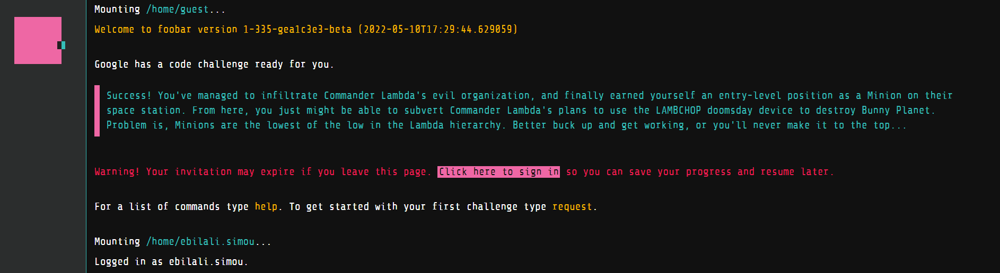

# Foobar with Google (2022)

FooBar is Google's semi-secret recruiting process embedded within their search engine that is accessed by invite only. There are 5 levels, each with a different number of challenges and you can solve them by using Java or Python 2.

<p align="center">
  
</p>
<p align="center">
  
</p>

 I used Python and documented here my solutions along with links and explainations for the most difficult ones. Since I do not have Python 2 installed in my machine I created a script that runs each solution inside a docker container. 

In order to run the solutions you would need to give it access 

```
$ chmox +x docker-python2.sh
```

and then execute each solution by providing the correct path e.g.

```
$ ./docker-python2.sh level-1/the-cake-is-not-a-lie/
```

If you are interested in solving these yourself, feel free to fork the repo and write your own solutions.

# Intro

Success! You've managed to infiltrate Commander Lambda's evil organization, and finally earned yourself an entry-level position as a Minion on their space station. From here, you just might be able to subvert Commander Lambda's plans to use the LAMBCHOP doomsday device to destroy Bunny Planet. Problem is, Minions are the lowest of the low in the Lambda hierarchy. Better buck up and get working, or you'll never make it to the top...

Why did you sign up for infiltration duty again? The pamphlets from Bunny HQ promised exotic and interesting missions, yet here you are drudging in the lowest level of Commander Lambda's organization. Hopefully you get that promotion soon...


# Chalenges
## Level 1
- [The cake is not a lie](level-1/the-cake-is-not-a-lie)
## Level 2
- [Elevator maintenance](level-2/elevator-maintenance)